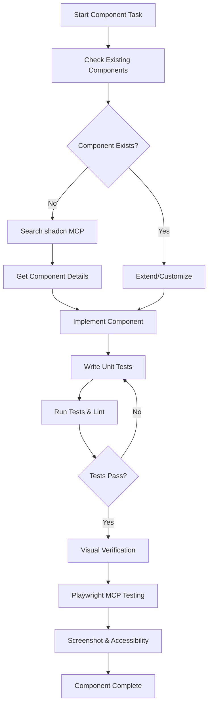

# CLAUDE.md

This file provides guidance to Claude Code (claude.ai/code) when working with code in this repository.

## Project Architecture

This is a Next.js 15 frontend application built with shadcn/ui as the foundation for our custom component library:

- **Framework**: Next.js 15 with App Router and Turbopack for development
- **React Version**: React 19 with TypeScript
- **Styling**: TailwindCSS v4 with custom CSS variables
- **UI System**: shadcn/ui component library with multiple registry sources
- **Component Foundation**: Radix UI primitives for accessibility and behavior
- **Variant Management**: class-variance-authority (CVA) for component variants
- **Testing**: Jest with React Testing Library for unit tests
- **Font Optimization**: Geist fonts loaded via next/font

**shadcn/ui Implementation**
This project uses shadcn/ui as the primary component system:

- **Copy-paste components**: We own and customize all component code
- **Multiple registries**: Components sourced from various shadcn registries (expanding as needed)
- **Custom theming**: CSS variables and Tailwind configuration for consistent design tokens
- **Accessible by default**: Built on Radix UI primitives for WAI-ARIA compliance

Component Registries (Current & Planned)

- **Official shadcn/ui**: Primary component source
- **Additional registries**: Will be added as project needs expand

### Key Dependencies

- **Authentication**: NextAuth.js for user authentication
- **Payments**: Stripe integration with React components
- **AI Integration**: AI SDK for React from Vercel
- **AWS Integration**: AWS Cognito Identity Provider client
- **Styling Utilities**: clsx, tailwind-merge for conditional classes
- **Icons**: Lucide React for consistent iconography

## MCP Server Integration

This project leverages **shadcn MCP server** and **Playwright MCP server** for enhanced development workflow:

### shadcn MCP Server
- **Purpose**: Provides AI-driven access to shadcn/ui component registry with context-aware suggestions
- **Capabilities**: Browse components, search registries, install with natural language, access demos and metadata
- **Benefits**: Ensures components are implemented correctly with proper context, preventing "off-looking" AI-generated UIs

### Playwright MCP Server
- **Purpose**: Browser automation for visual component verification and testing
- **Capabilities**: Accessibility tree-based verification, screenshot-based visual diffing, automated test generation
- **Benefits**: Real-time visual verification, automated regression detection, AI-generated tests

## Development Commands

```bash
# Development
pnpm dev              # Start Next.js dev server with Turbopack
pnpm build            # Build for production with Turbopack
pnpm start            # Start production server
pnpm lint             # Run ESLint

# Testing
pnpm test             # Run Jest unit tests
pnpm test:watch       # Run tests in watch mode
pnpm test:coverage    # Run tests with coverage report

# shadcn/ui (Enhanced with MCP)
npx shadcn@latest add [component]  # Add components from registries
# Use mcp__shadcn__getComponents for browsing available components
# Use mcp__shadcn__getComponent for detailed component information

# Visual Testing (MCP Playwright)
# Use mcp__playwright__ tools for component verification after development
```

## Architecture Patterns

### Component Structure
- **shadcn/ui Components**: Copy-paste components from various shadcn registries
- **Custom Components**: Built using shadcn patterns and extending base components
- **App Router**: Next.js 15 App Router structure with `layout.tsx` and `page.tsx` files
- **Utilities**: Shared utilities including the `cn()` function for class merging


### Enhanced shadcn/ui Component Workflow with MCP

**ALWAYS follow this component development workflow:**

1. **Discover Existing Components**
   - First check local `components/ui/` directory for existing components
   - Use `mcp__shadcn__getComponents` to browse available shadcn registry components
   - Search through existing codebase for similar patterns or components

2. **Component Analysis & Selection**
   - If existing component meets needs → extend or customize it
   - If no suitable component exists → use `mcp__shadcn__getComponent` for detailed component information
   - Review component demos, installation instructions, and usage patterns

3. **Implementation with Context**
   - Use component information from MCP server to implement correctly
   - Follow shadcn/ui patterns: CVA variants, Slot composition, proper TypeScript interfaces
   - Maintain consistency with existing component architecture

### shadcn/ui Component Pattern
All components follow the shadcn/ui conventions:
- **CVA variants**: Consistent variant API across all components
- **Composable**: Support `asChild` prop via Radix UI Slot for flexible composition
- **Customizable**: Easy to modify styling and behavior since we own the code
- **Accessible**: Built on Radix UI primitives for robust accessibility
- **TypeScript**: Full type safety with proper prop interfaces
- **MCP-Enhanced**: Leverage shadcn MCP server for proper implementation context

```tsx
// Example shadcn/ui component structure
import * as React from "react"
import { Slot } from "@radix-ui/react-slot"
import { VariantProps } from "class-variance-authority"
import { cn } from "@/lib/utils"
import { buttonVariants } from "@/components/ui/button"

const Button = React.forwardRef<
    React.ElementRef<"button">,
    React.ComponentPropsWithoutRef<"button"> & VariantProps<typeof buttonVariants>
>(({ className, variant, size, asChild = false, ...props }, ref) => {
    const Comp = asChild ? Slot : "button"
    return (
        <Comp
            className={cn(buttonVariants({ variant, size, className }))}
            ref={ref}
            {...props}
        />
    )
})

Button.displayName = "Button"
```

### Testing Strategy
- Unit tests only - no integration or E2E tests in this directory
- Jest configuration with Next.js integration via `next/jest`
- Mock external dependencies (Next.js Image, etc.)
- Test component rendering, props, variants, and user interactions
- Tests located in `__tests__` directories alongside source files

### Visual Component Verification with Playwright MCP

**MANDATORY workflow after completing any visual component:**

1. **Post-Development Verification**
   - After unit tests pass and lint succeeds
   - Use `mcp__playwright__browser_navigate` to navigate to component in development server
   - Use `mcp__playwright__browser_snapshot` for accessibility tree verification

2. **Visual Testing Process**
   - Use `mcp__playwright__browser_take_screenshot` to capture component visuals
   - Test component in different viewport sizes with `mcp__playwright__browser_resize`
   - Verify interactive states (hover, focus, disabled) with `mcp__playwright__browser_hover` and `mcp__playwright__browser_click`

3. **Accessibility & User Experience Validation**
   - Verify proper ARIA roles and labels through accessibility snapshots
   - Test keyboard navigation and screen reader compatibility
   - Ensure component meets WCAG guidelines through Playwright's accessibility tree

4. **Chrome Browser only & Responsive Testing**
   - Test component in Chrome browser only
   - Verify responsive behavior at various breakpoints
   - Validate component performance and rendering consistency

**When Visual Testing is Required:**
- ✅ New UI components or major component modifications
- ✅ Layout changes or styling updates
- ✅ Interactive element implementations (buttons, forms, modals)
- ✅ Responsive design implementations
- ❌ Simple text changes or minor styling tweaks
- ❌ Backend logic or API integrations (unless they affect UI)

## Complete MCP-Enhanced Development Workflow

**Full component development cycle using MCP servers:**



### Integration Best Practices

1. **Context-First Development**
   - Always use shadcn MCP server for component discovery and implementation guidance
   - Leverage existing component patterns before creating new ones
   - Maintain consistency with project's design system

2. **Quality Assurance Pipeline**
   - Unit tests → Lint → Visual verification → Accessibility testing
   - Use Playwright MCP for real browser testing after development
   - Document any visual regressions or accessibility issues

3. **MCP Server Usage Patterns**
   - **Discovery Phase**: `mcp__shadcn__getComponents` → browse available options
   - **Implementation Phase**: `mcp__shadcn__getComponent` → get detailed specs
   - **Verification Phase**: `mcp__playwright__` tools → visual and functional testing
   - **Documentation Phase**: Screenshot generation for design system documentation

4. **Collaboration & Handoff**
   - Use Playwright screenshots for design review and stakeholder communication
   - Generate accessibility reports through MCP server for compliance documentation
   - Create visual test coverage for regression prevention

## Configuration Files

- `next.config.ts`: Basic Next.js configuration
- `jest.config.js`: Jest setup with Next.js integration and path mapping for `@/` imports
- `jest.setup.js`: Test environment setup with testing-library/jest-dom
- `eslint.config.mjs`: ESLint configuration extending Next.js and TypeScript rules
- `components.json`: shadcn/ui configuration for component generation


## Key Files for Understanding Architecture

- `lib/utils.ts`: Core utility functions, especially `cn()` for class merging
- `components/ui/button.tsx`: Example of the component pattern with variants and composition
- `app/layout.tsx`: Root layout with font optimization and global styles

## shadcn/ui Philosophy
This project embraces the shadcn/ui approach of:

- **Copy, don't install**: We own our component code for maximum customization
- **Composable components**: Built for flexibility and reuse
- **Design system consistency**: Unified theming via CSS variables
- **Developer experience**: TypeScript, excellent APIs, and clear pattern